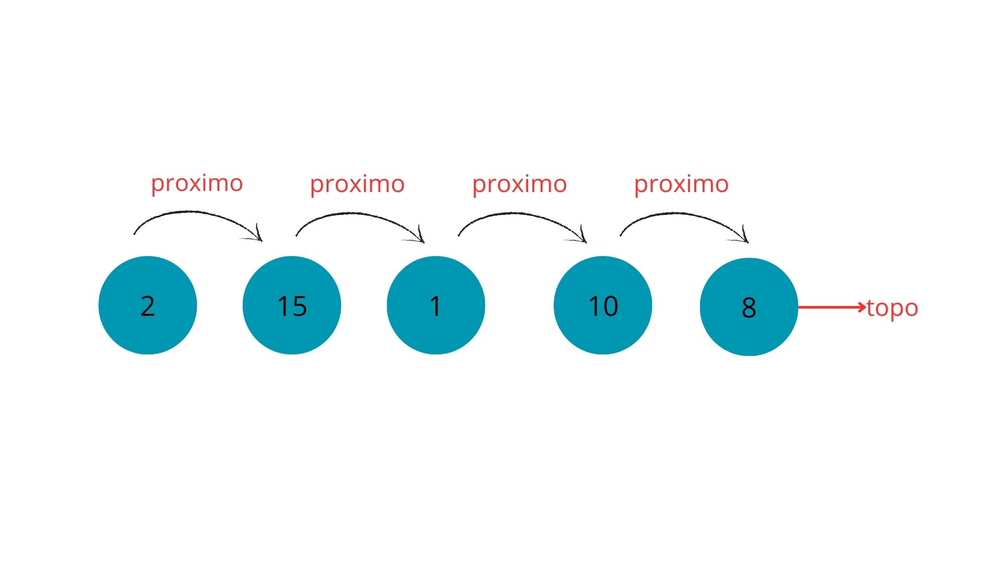

[🏠 Voltar para o Início](../README.md)

# 📘 Tema 06 – Pilha

## 🧠 O que é uma pilha?

A pilha (Stack) é uma estrutura de dados do tipo **LIFO** — *Last In, First Out*, ou seja, o **último elemento inserido é o primeiro a ser removido**.  
Ela funciona como uma pilha de pratos: você só pode retirar o prato que está por cima.

Veja na imagem abaixo uma representação clara do funcionamento **LIFO** (*Last In, First Out*).  
Repare que o **primeiro elemento a entrar** vai direto para a base da pilha.  
Quando um novo elemento é inserido, ele ocupa o **topo**. E ao remover um item, é **sempre o do topo** que sai primeiro.

Pense em uma pilha de pratos:  
Se você tentar tirar um prato do fundo, o que acontece?  
💥 A pilha desmorona.  
É por isso que só conseguimos acessar o que está por cima — exatamente como funciona em uma estrutura de dados do tipo pilha.

---

## 🔧 Operações fundamentais

Todas as pilhas que vimos possuem os seguintes métodos:

| Método        | O que faz                                                  |
|---------------|------------------------------------------------------------|
| `empilhar()`  | Adiciona um novo elemento no topo da pilha                |
| `desempilhar()` | Remove e retorna o elemento do topo da pilha            |
| `topo` (property) | Retorna o elemento do topo sem removê-lo              |
| `imprimir()`  | Mostra os elementos da pilha do início ao topo            |

---

## 1️⃣ PilhaSimples – implementação com lista Python

A `PilhaSimples` é uma implementação direta utilizando uma lista nativa do Python (`list`).  
Ela serve como introdução ao conceito de pilha, usando métodos simples como `append()` e `pop()`.

### Como funciona?

- Elementos são armazenados em uma lista: `self._dados = []`
- `empilhar()` usa `.append()`
- `desempilhar()` usa `.pop()`
- O acesso ao topo é feito por `self._dados[-1]`

### Pontos positivos:
- Simples e eficiente para fins didáticos
- Aproveita os métodos otimizados da lista do Python

📄 [Ver código da PilhaSimples](./pilha_simples.py)

---

## 2️⃣ PilhaSequencial – com array fixo e redimensionamento

Essa versão simula uma pilha sobre **um array com tamanho fixo**, que é duplicado automaticamente se ficar cheio.  
Ela usa a classe `Array`, que encapsula uma lista com tamanho pré-definido.

### Características:

- A pilha começa com um array de tamanho fixo (`tamanho=3`)
- Se o array estiver cheio, o método `_redimensionar()` é chamado:
  - Cria um novo array com o dobro do tamanho
  - Copia os dados antigos para o novo
- O acesso aos elementos é feito por métodos `get()` e `set()` do `Array`

### Validações:
- `cheia`: compara o topo com o tamanho total
- `vazia`: verifica se o topo é 0
- Levanta `PilhaVazia` ao desempilhar uma pilha sem elementos

📄 [Ver código da PilhaSequencial](./pilha_sequencial.py)

---

## 3️⃣ PilhaEncadeada – com nós e ponteiros

A `PilhaEncadeada` é a forma mais completa e **mais próxima do uso profissional** de pilhas.  
Ela utiliza uma **estrutura dinâmica**, ou seja, cresce conforme necessário e **não precisa de redimensionamento**.

### Estrutura principal

A pilha é formada por **nós** (`Node`) encadeados, onde cada nó contém:

- `valor`: o dado armazenado
- `proximo`: referência para o próximo nó (o que está abaixo dele na pilha)

O atributo `_topo` da pilha aponta sempre para o último elemento inserido.

### Ilustração conceitual:

### Métodos:

- `empilhar(elemento)`:
  - Cria um novo nó (`Node`)
  - O novo nó aponta para o antigo topo
  - Atualiza o `_topo` para esse novo nó

- `desempilhar()`:
  - Se a pilha estiver vazia, levanta `PilhaVazia`
  - Move o `_topo` para o nó anterior
  - Diminui o tamanho da pilha

- `topo` (property):
  - Retorna o `valor` do `_topo`
  - Também verifica se está vazia

- `imprimir()`:
  - Percorre os nós da pilha do topo até o último e imprime os valores

### Vantagens da encadeada:

| Vantagem                              | Por quê?                                   |
|--------------------------------------|--------------------------------------------|
| Memória dinâmica                     | Não precisa definir tamanho fixo           |
| Não precisa redimensionar            | Evita cópias de dados                      |
| Rápida para empilhar/desempilhar     | Apenas altera ponteiros                    |
| Reflete melhor estruturas de execução| Ex: pilha de chamadas de funções           |

### Desvantagens:

- Mais complexa para implementar
- Ocupa um pouco mais de memória por conta dos ponteiros

📄 [Ver código da PilhaEncadeada](./pilha_encadeada.py)

---

## 🧪 Exercício prático

Implemente um pequeno programa que:

1. Crie uma pilha com uma das três versões
2. Empilhe 3 valores
3. Mostre o valor do topo
4. Desempilhe e mostre os elementos um a um
5. Imprima a pilha final

---

## 💡 Desafio

- Implemente um método de inversão de uma string usando a `PilhaEncadeada`
  - Imagem de exemplo:
     

📄 [Ver solução da inversão de string](./inverter_string.py)

---

## 🔗 Complementos

- [Videoaula - Pilha Sequencial (Thiago Moura)](https://www.youtube.com/watch?v=4CjDXi-wu8o&list=PLHskJyf7fQWVN9sy_qWo75i3Pnyryj61M&index=12)
- [Videoaula - Pilha Encadeada (Thiago Moura)](https://www.youtube.com/watch?v=IZqYAzuHjRo&list=PLHskJyf7fQWVN9sy_qWo75i3Pnyryj61M&index=13)
- [Documentação Python – Listas](https://docs.python.org/3/tutorial/datastructures.html)
